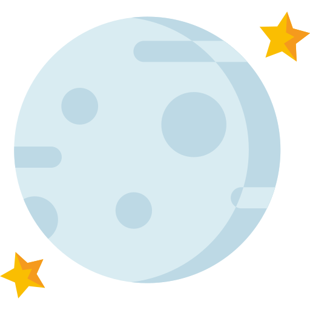
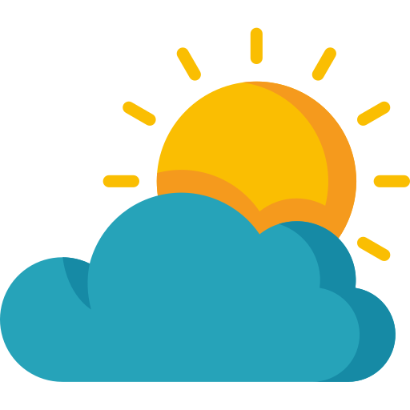
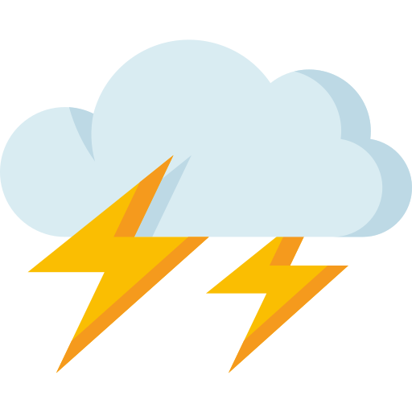
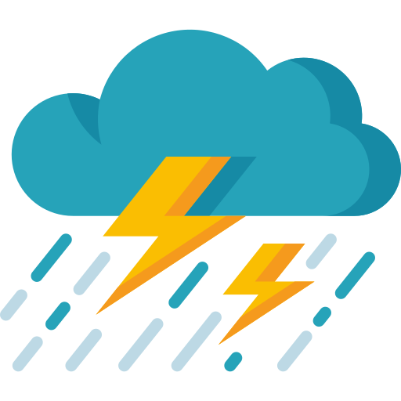
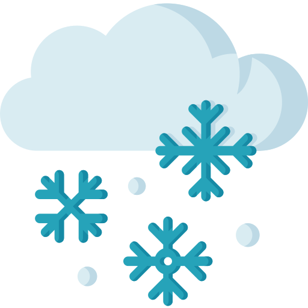
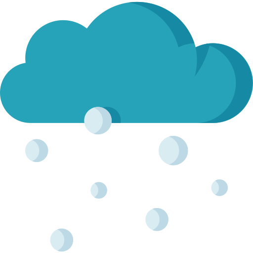
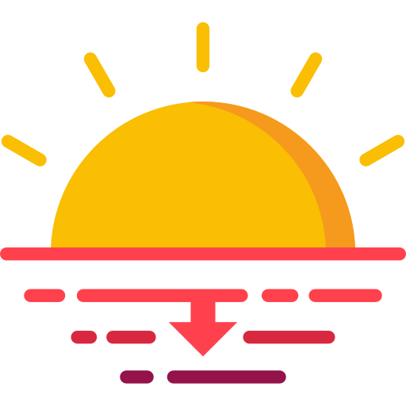

# Icons
These icons were created by [Good Ware at Flaticon](https://www.flaticon.com/packs/weather-219). They are free to use with attribution. Each icon has been saved with a id that relates to the icon id returned by the Open Weather API: [see this table](https://openweathermap.org/weather-conditions).

|id |Weather Condition  |Day    |Night  |Notes  |
|---|---|---|---|---|
|01d, 01n|Clear Sky|||    |
|02d, 02n|Few Clouds|||11-25% Cloudy |
|03d, 03n|Scattered Clouds|||26-50% Cloudy|
|04d, 04n|Broken or Overcast Clouds|||51-100% Cloudy|
|09d, 09n|Light Rain|||  |
|10d, 10n|Moderate Rain|||  |
|11d, 11n|Thunderstorms|||  |
|13d, 13n|Snow|||  |

Additionally, I might use the following icons to illustrate some of the other weather data I am importing from the Open Weather API:

|Sunrise|Sunset|Celsius|Farenheit|
|---|---|---|---|
|| |||
|**Wind Speed**|**Humidity**|**UV Index**||
||| | |

Although I am a developer rather t han a graphic designer, there are two small tasks relating to the icons I'd like to get done when I have the chance: 
1. Resize the images to make sure they are consistent (especially sunrise / sunset, celsius/farenheit, clear sky images)
2. Create some unique night time rain icons - the pack didn't have these. I would recolour the cloud blue and put a moon behind the cloud.

There is also the possibility to expand this library to cover a greater range of weather codes: there are more detailed weather descriptors with corresponding id codes [in this table](https://openweathermap.org/weather-conditions#Weather-Condition-Codes-2).